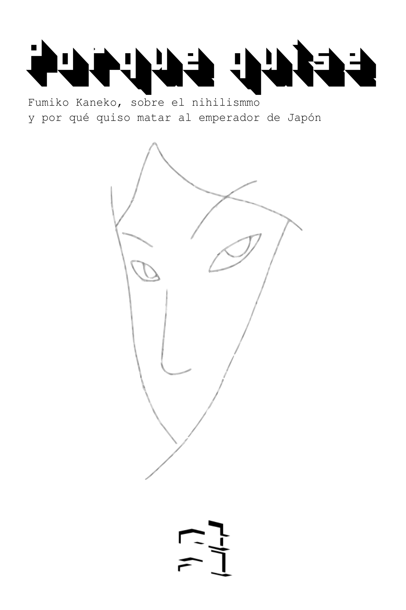

--- 
title: "Porque quise"
author: "Fumiko Kaneko"
date: "01/01/2020"
output: bookdown::gitbook
site: bookdown::bookdown_site
documentclass: book
bibliography: [book.bib, packages.bib]
biblio-style: apalike
link-citations: yes
description: "Kaneko Fumiko, sobre el nihilismo y por qué quiso matar al Emperador de Japón"
---

# {-}

```{r setup, include=FALSE}
knitr::opts_chunk$set(echo = FALSE)
options(knitr.graphics.auto_pdf = TRUE)
```



Kaneko, Fumiko

Porque quise / 1a ed. - Ciudad Interdimensional de
Buenos Aires: etal, 2021.

Compilación: Max Res

Traducción: alf

Título original: *Because I wanted to*.


# Licencia de Producción de Pares (Versión legible por humanes) {-}

> Esto es un resumen legible por humanos del [texto legal (la licencia
> completa)](http://endefensadelsl.org/ppl_es.html)

## Ud. es libre de {-}

* Compartir - copiar, distribuir, ejecutar y comunicar públicamente la obra
* Hacer obras derivadas

## Bajo las condiciones siguientes: {-}


## Entendiendo que {-}

* **Renuncia** - Alguna de estas condiciones puede no aplicarse si se obtiene
  el permiso del titular de los derechos de autor.

* **Dominio Público** - Cuando la obra o alguno de sus elementos se halle en
  el dominio público según la ley vigente aplicable, esta situación no quedará
  afectada por la licencia.

* **Otros derechos** - Los derechos siguientes no quedan afectados por
  la licencia de ninguna manera:

    + Los derechos derivados de usos legítimos u otras limitaciones
      reconocidas por ley no se ven afectados por lo anterior;

    + Los derechos morales del autor;

    + Derechos que pueden ostentar otras personas sobre la propia obra o
      su uso, como por ejemplo derechos de imagen o de privacidad.

* **Aviso** - Al reutilizar o distribuir la obra, tiene que dejar muy en claro
  los términos de la licencia de esta obra.  La mejor forma de hacerlo es
  enlazar a esta página.